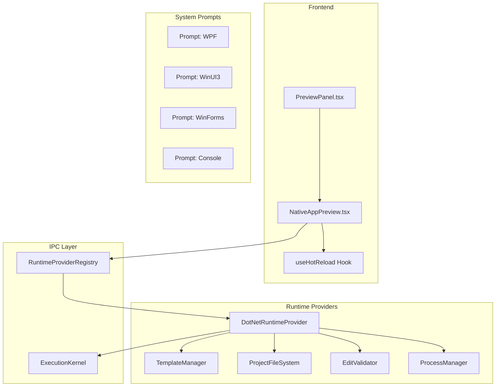

# Windows Native App Builder - Phase 2 Plan

## Overview

This plan outlines the verification and refinement tasks for the Windows Native App Builder infrastructure. The core implementation is largely complete, but there are gaps in testing and some refinements needed.

## Initial Audit Findings

### 1. DotNetRuntimeProvider.ts Analysis

**Location:** [`src/ipc/runtime/providers/DotNetRuntimeProvider.ts`](src/ipc/runtime/providers/DotNetRuntimeProvider.ts)

**Current Implementation:**

- Implements `RuntimeProvider` interface for .NET applications
- Supports: WPF, WinUI3, WinForms, Console, MAUI
- Key methods: `scaffold()`, `build()`, `run()`, `applyEdit()`, `resolveDependencies()`
- Has compiler error parsing via `parseCompilerErrors()` and `parseDependencyErrors()`
- Uses `executionKernel` for secure command execution

**Identified Gaps:**

- Compiler error parsing handles MSBuild format but may miss some edge cases
- State management uses in-memory `Map<number, ProjectState>` - needs persistence verification

### 2. TemplateManager.ts Analysis

**Location:** [`src/ipc/runtime/providers/dotnet/TemplateManager.ts`](src/ipc/runtime/providers/dotnet/TemplateManager.ts)

**Current Implementation:**

- Manages templates for WPF, WinUI3, WinForms, Console, MAUI
- Placeholder replacement: `{{ProjectName}}`, `{{Namespace}}`, `{{TargetFramework}}`
- Project name sanitization for valid C# identifiers

**Identified Gaps:**

- No property-based tests for placeholder replacement edge cases
- Template validation could be enhanced

### 3. NativeAppPreview.tsx Analysis

**Location:** [`src/components/preview_panel/NativeAppPreview.tsx`](src/components/preview_panel/NativeAppPreview.tsx)

**Current Implementation:**

- External-window preview strategy for native apps
- Hot reload support via `useHotReload` hook
- Status management: idle, starting, running, stopped, error
- Screenshot capture capability
- Log streaming from app output

**Identified Gaps:**

- E2E tests need to verify hot reload functionality
- State persistence across app lifecycle needs verification

### 4. System Prompt Integration

**Verified Files:**

- [`src/prompts/system/dotnet_wpf.ts`](src/prompts/system/dotnet_wpf.ts) - WPF-specific guidance
- [`src/prompts/system/dotnet_winui3.ts`](src/prompts/system/dotnet_winui3.ts) - WinUI3-specific guidance
- [`src/prompts/system/dotnet_winforms.ts`](src/prompts/system/dotnet_winforms.ts) - WinForms-specific guidance
- [`src/prompts/system/dotnet_console.ts`](src/prompts/system/dotnet_console.ts) - Console app guidance

**Integration Status:** ✅ All prompts are imported and used in [`src/prompts/system_prompt.ts`](src/prompts/system_prompt.ts)

### 5. Existing Test Coverage

**Unit Tests (in `src/ipc/runtime/__tests__/`):**

- `DotNetRuntimeProvider.build.property.test.ts` - Build property tests
- `DotNetRuntimeProvider.build.unit.test.ts` - Build unit tests
- `DotNetRuntimeProvider.dependencies.property.test.ts` - Dependency resolution tests
- `DotNetRuntimeProvider.dependencies.unit.test.ts` - Dependency unit tests
- `DotNetRuntimeProvider.editing.unit.test.ts` - Edit validation tests
- `DotNetRuntimeProvider.filesystem.property.test.ts` - File system property tests
- `DotNetRuntimeProvider.filesystem.unit.test.ts` - File system unit tests
- `DotNetRuntimeProvider.process.property.test.ts` - Process management tests
- `DotNetRuntimeProvider.process.unit.test.ts` - Process unit tests
- `DotNetRuntimeProvider.scaffold.test.ts` - Scaffold tests
- `HotReloadManager.test.ts` - Hot reload tests

**E2E Tests (in `e2e-tests/`):**

- `wpf_integration.spec.ts` - WPF lifecycle test
- `winui3_integration.spec.ts` - WinUI3 lifecycle test (has typo bug)
- `winforms_integration.spec.ts` - WinForms lifecycle test (has typo bug)

---

## Task Breakdown

### Task 18: Integration Testing (E2E)

#### 18.1 Fix Existing E2E Test Bugs

**Issue:** Both [`winui3_integration.spec.ts`](e2e-tests/winui3_integration.spec.ts:23) and [`winforms_integration.spec.ts`](e2e-tests/winforms_integration.spec.ts:23) have a typo:

```typescript
// Current (buggy):
expect(cspojContent).toContain("UseWinUI");

// Should be:
expect(csprojContent).toContain("UseWinUI");
```

**Action:** Fix the variable name typo in both test files.

#### 18.2 Enhance WPF Integration Test

**Current Coverage:** Basic lifecycle (create → launch → stop)

**Additional Scenarios Needed:**

1. Edit XAML file and verify hot reload
2. Edit C# code-behind and verify rebuild
3. Verify error display when build fails

**Test File:** `e2e-tests/wpf_integration.spec.ts`

#### 18.3 Enhance WinUI3 Integration Test

**Current Coverage:** Basic lifecycle with typo bug

**Additional Scenarios Needed:**

1. Fix typo bug
2. Verify Windows App SDK package references
3. Test build error handling (invalid XAML)

**Test File:** `e2e-tests/winui3_integration.spec.ts`

#### 18.4 Enhance WinForms Integration Test

**Current Coverage:** Basic lifecycle with typo bug

**Additional Scenarios Needed:**

1. Fix typo bug
2. Verify form designer code generation
3. Test hot reload for property changes

**Test File:** `e2e-tests/winforms_integration.spec.ts`

---

### Task 19: Property-Based Testing

#### 19.1 XAML Validity Property Tests

**Location:** `src/ipc/runtime/__tests__/DotNetRuntimeProvider.xaml.property.test.ts` (new file)

**Properties to Test:**

1. **Well-formed XML:** All generated XAML should be valid XML
2. **Namespace consistency:** `x:Class` attribute should match namespace + class name
3. **Balanced tags:** All opening tags have matching closing tags
4. **Attribute quoting:** All attributes have properly quoted values

**Test Approach:**

```typescript
// Use fast-check for property-based testing
import * as fc from "fast-check";

// Property: For any valid project name, generated XAML should be valid XML
fc.assert(
  fc.property(fc.stringMatching(/^[A-Z][a-zA-Z0-9_]*$/), (projectName) => {
    const template = templateManager.getTemplate("wpf");
    const instantiated = templateManager.instantiateTemplate(
      template,
      projectName,
    );
    const xamlFiles = instantiated.files.filter((f) => f.type === "xaml");

    for (const file of xamlFiles) {
      const parseResult = parseXaml(file.content);
      expect(parseResult.isValid).toBe(true);
    }
  }),
);
```

#### 19.2 Template Placeholder Replacement Property Tests

**Location:** `src/ipc/runtime/__tests__/TemplateManager.placeholder.property.test.ts` (new file)

**Properties to Test:**

1. **No unreplaced placeholders:** After instantiation, no `{{...}}` patterns should remain
2. **Project name propagation:** Project name appears in all expected locations
3. **Namespace consistency:** Namespace derived from project name is consistent across files
4. **Sanitization safety:** Even invalid project names produce valid identifiers

**Test Approach:**

```typescript
// Property: For any string, sanitization produces valid C# identifier
fc.assert(
  fc.property(fc.string(), (rawName) => {
    const sanitized = templateManager.sanitizeProjectName(rawName);
    expect(/^[A-Z][a-zA-Z0-9_]*$/.test(sanitized)).toBe(true);
  }),
);

// Property: All placeholders are replaced after instantiation
fc.assert(
  fc.property(fc.stringMatching(/^[A-Z][a-zA-Z0-9_]*$/), (projectName) => {
    const template = templateManager.getTemplate("wpf");
    const instantiated = templateManager.instantiateTemplate(
      template,
      projectName,
    );

    for (const file of instantiated.files) {
      expect(file.content).not.toMatch(/\{\{.*?\}\}/);
    }
  }),
);
```

---

### Task 15: Error Handling Refinement

#### 15.1 Verify State Persistence Across Lifecycle

**Scope:** Ensure `ProjectState` is properly persisted and restored

**Test Scenarios:**

1. State survives app restart (if persistence implemented)
2. State is correctly updated after each operation
3. State cleanup when app is deleted

**Files to Review:**

- [`src/ipc/runtime/providers/DotNetRuntimeProvider.ts`](src/ipc/runtime/providers/DotNetRuntimeProvider.ts:64-70) - `projectStates` Map

**Potential Enhancement:**

- Consider persisting state to disk for recovery scenarios

#### 15.2 Enhance Compiler Error Parsing

**Current Implementation:** [`parseCompilerErrors()`](src/ipc/runtime/providers/DotNetRuntimeProvider.ts:72-109)

**Edge Cases to Handle:**

1. Multi-line error messages
2. Errors without file location (e.g., SDK errors)
3. Localized error messages (non-English)
4. Warning-as-error scenarios
5. NuGet package conflict errors

**Enhanced Parser Design:**

```typescript
interface EnhancedCompilerError extends CompilerError {
  category: "syntax" | "semantic" | "dependency" | "sdk" | "unknown";
  suggestions?: string[];
  relatedErrors?: string[];
}
```

---

### Task 16: State Management Refinement

#### 16.1 State Lifecycle Verification

**Test File:** `src/ipc/runtime/__tests__/DotNetRuntimeProvider.state.unit.test.ts` (new file)

**Test Cases:**

1. State is initialized on scaffold
2. State is updated after build (executable path)
3. State is updated after edit (file map)
4. State is cleaned up on app deletion

#### 16.2 Error State Handling

**Test Cases:**

1. Build failure preserves previous valid state
2. Run failure updates state appropriately
3. Error recovery flow

---

## Architecture Diagram



---

## Test Execution Order

1. **Fix existing bugs first** - Typos in E2E tests
2. **Add property tests** - XAML validity and placeholder replacement
3. **Enhance E2E tests** - Add edit and error scenarios
4. **Add state management tests** - Lifecycle verification
5. **Enhance error parsing** - Edge case handling

---

## Files to Create/Modify

### New Files

1. `src/ipc/runtime/__tests__/DotNetRuntimeProvider.xaml.property.test.ts`
2. `src/ipc/runtime/__tests__/TemplateManager.placeholder.property.test.ts`
3. `src/ipc/runtime/__tests__/DotNetRuntimeProvider.state.unit.test.ts`

### Modified Files

1. `e2e-tests/winui3_integration.spec.ts` - Fix typo, add scenarios
2. `e2e-tests/winforms_integration.spec.ts` - Fix typo, add scenarios
3. `e2e-tests/wpf_integration.spec.ts` - Add edit scenarios
4. `src/ipc/runtime/providers/DotNetRuntimeProvider.ts` - Enhanced error parsing (optional)

---

## Success Criteria

1. All E2E tests pass without typos
2. Property tests cover XAML validity and placeholder replacement
3. State management is verified across lifecycle
4. Error parsing handles documented edge cases
5. All tests pass: `npm run test` and `npm run test:e2e`
